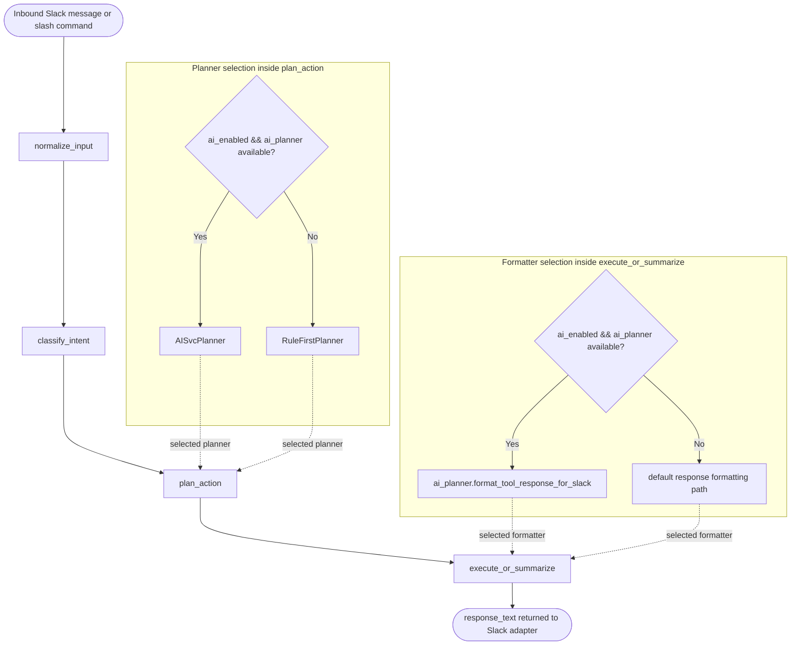

# Broker Runtime Graph

This diagram shows the active LangGraph pipeline assembled in
`opamp_broker/graph/graph.py`, plus the runtime planner/formatter selection
used by `plan_action` and `execute_or_summarize`.

## Source

- Mermaid source: [broker_runtime_graph.mmd](./broker_runtime_graph.mmd)
