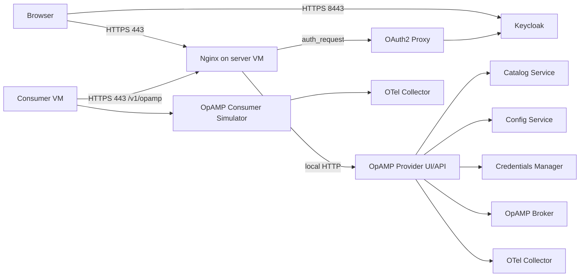
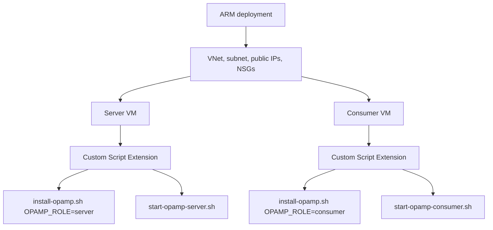
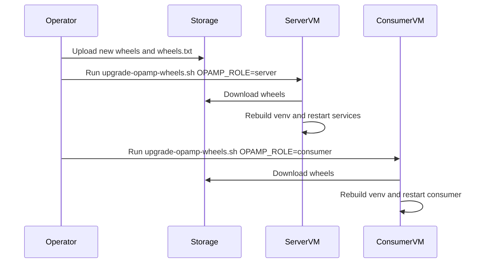

# OpAMP Azure Deployment

This folder contains an Azure Resource Manager deployment for a two-VM OpAMP
environment:

- one OpAMP server VM that runs the provider UI/API and supporting services
- one consumer VM that installs the consumer wheels and starts a simulator consumer
- Keycloak for UI identities
- OAuth2 Proxy and Nginx to protect the UI over HTTPS
- OpenTelemetry Collector on both VMs for self telemetry

The deployment is intended for regression, upgrade, and demonstration use. It
uses self-signed certificates by default.

## Architecture





## What Gets Created

The ARM template creates:

- a resource group deployment containing all resources
- a virtual network with one subnet
- two public IP addresses with DNS names
- two Ubuntu 22.04 VMs
- one network interface per VM
- one network security group per VM
- a Custom Script Extension on each VM

The server VM listens publicly on:

- `443` for the OpAMP UI, protected by Keycloak login through OAuth2 Proxy
- `8443` for Keycloak
- `22` for SSH from `adminSourceCidr`

The consumer VM listens publicly only on SSH from `adminSourceCidr`.

## Files

- `mainTemplate.json` - ARM template for infrastructure and VM bootstrap
- `parameters.example.json` - example parameters file to copy and edit
- `deploy.sh` / `deploy.ps1` - create or update the resource group deployment
- `destroy.sh` / `destroy.ps1` - delete the resource group and everything in it
- `scripts/package-cloud-artifacts.sh` - builds wheels and prepares deployable artifacts
- `scripts/install-opamp.sh` - installs OS packages, downloads or builds wheels, creates venvs
- `scripts/start-opamp-server.sh` - starts server-side services, Keycloak, OAuth2 Proxy, Nginx, and OTel Collector
- `scripts/start-opamp-consumer.sh` - starts the consumer simulator and OTel Collector
- `scripts/upgrade-opamp-wheels.sh` - independently reruns install and start for upgrade regression

Microsoft references:

- ARM template deployments: <https://learn.microsoft.com/en-us/azure/azure-resource-manager/templates/overview>
- Linux Custom Script Extension: <https://learn.microsoft.com/en-us/azure/virtual-machines/extensions/custom-script-linux>
- Azure CLI group deployments: <https://learn.microsoft.com/en-us/azure/azure-resource-manager/templates/deploy-cli>

## Prerequisites

Install these on your workstation:

- Azure CLI
- Docker, only needed if you also run the local wheel regression containers
- Python 3.10 or newer
- Bash, or PowerShell on Windows
- an Azure subscription
- an SSH key pair

Sign in to Azure:

```bash
az login
az account show
```

If you have more than one subscription:

```bash
az account set --subscription "<subscription id or name>"
```

Create an SSH key if you do not have one:

```bash
ssh-keygen -t rsa -b 4096 -f ~/.ssh/opamp-azure
```

Find your public IP address:

```bash
curl https://api.ipify.org
```

Use that value with `/32` for `adminSourceCidr`.

## Package The Artifacts

The Azure VM extension must download scripts from an HTTPS URL. The simplest
path is to package the scripts and wheels, upload them to Azure Storage, then
give the template the storage URL.

From the repository root:

```bash
bash cloud/azure/scripts/package-cloud-artifacts.sh
```

This creates:

```text
dist/cloud-azure-artifacts/
  scripts/
  wheels/
    wheels.txt
    *.whl
```

Create a storage account and container:

```bash
RESOURCE_GROUP=opamp-artifacts-rg
LOCATION=uksouth
STORAGE_ACCOUNT=<globally-unique-storage-name>

az group create --name "$RESOURCE_GROUP" --location "$LOCATION"
az storage account create \
  --resource-group "$RESOURCE_GROUP" \
  --name "$STORAGE_ACCOUNT" \
  --location "$LOCATION" \
  --sku Standard_LRS \
  --allow-blob-public-access true
az storage container create \
  --account-name "$STORAGE_ACCOUNT" \
  --name opamp-cloud \
  --public-access blob \
  --auth-mode login
az storage blob upload-batch \
  --account-name "$STORAGE_ACCOUNT" \
  --destination opamp-cloud \
  --source dist/cloud-azure-artifacts \
  --auth-mode login \
  --overwrite
```

Your artifact URL will look like:

```text
https://<storage-account>.blob.core.windows.net/opamp-cloud
```

Use that value for both `artifactBaseUrl` and `wheelArtifactBaseUrl`.

## Configure Parameters

Copy the example file:

```bash
cp cloud/azure/parameters.example.json cloud/azure/parameters.local.json
```

Edit `cloud/azure/parameters.local.json`:

- replace `sshPublicKey` with the contents of your `.pub` key
- replace `adminSourceCidr` with your public IP plus `/32`
- replace both artifact URLs with your storage container URL
- set `keycloakAdminPassword` to a long password
- change `location` if required

Keep `parameters.local.json` out of source control.

## Deploy

Bash:

```bash
RESOURCE_GROUP=opamp-regression-rg \
LOCATION=uksouth \
PARAMETERS_FILE=cloud/azure/parameters.local.json \
bash cloud/azure/deploy.sh
```

PowerShell:

```powershell
.\cloud\azure\deploy.ps1 `
  -ResourceGroup opamp-regression-rg `
  -Location uksouth `
  -ParametersFile cloud/azure/parameters.local.json
```

When the deployment completes, Azure prints outputs like:

- `opampUiUrl`
- `keycloakUrl`
- `serverSsh`
- `consumerSsh`

Open `opampUiUrl` in a browser. Because the certificate is self-signed, the
browser will show a certificate warning. Continue only if the hostname matches
the deployed server.

## UI Credentials

The startup script creates an OpAMP realm user in Keycloak. SSH to the server
VM and read the generated credentials:

```bash
ssh azureuser@<server-fqdn>
sudo cat /etc/opamp/opamp-ui-user.txt
```

You can then log in through the UI. Further user and password changes are made
inside Keycloak.

## Check The Deployment

SSH to the server VM:

```bash
sudo systemctl status opamp-provider
sudo systemctl status config-service
sudo systemctl status catalog-service
sudo systemctl status svr-credentials-manager-service
sudo systemctl status opamp-broker
sudo docker ps
```

SSH to the consumer VM:

```bash
sudo systemctl status opamp-consumer-simulator
sudo docker ps
```

Logs:

```bash
sudo journalctl -u opamp-provider -n 100 --no-pager
sudo journalctl -u opamp-consumer-simulator -n 100 --no-pager
sudo tail -n 100 /var/log/opamp/otel-collector.json
```

## Upgrade Regression

Upload a new artifact pack to the same storage container, then rerun the upgrade
script independently on either VM.

Server VM:

```bash
sudo OPAMP_ROLE=server \
  OPAMP_WHEEL_SOURCE_URL=https://<storage-account>.blob.core.windows.net/opamp-cloud \
  bash /var/lib/waagent/custom-script/download/0/upgrade-opamp-wheels.sh
```

Consumer VM:

```bash
sudo OPAMP_ROLE=consumer \
  OPAMP_WHEEL_SOURCE_URL=https://<storage-account>.blob.core.windows.net/opamp-cloud \
  OPAMP_SERVER_URL=https://10.42.0.10 \
  OPAMP_SERVER_HOST=<server-fqdn> \
  bash /var/lib/waagent/custom-script/download/0/upgrade-opamp-wheels.sh
```



## Tear Down

Deleting the deployment resource group removes the VMs, disks, IP addresses,
NICs, and network resources.

Bash:

```bash
RESOURCE_GROUP=opamp-regression-rg bash cloud/azure/destroy.sh
```

PowerShell:

```powershell
.\cloud\azure\destroy.ps1 -ResourceGroup opamp-regression-rg
```

The artifact storage account is separate in this guide. Delete it when no
longer needed:

```bash
az group delete --name opamp-artifacts-rg --yes --no-wait
```

## Notes And Limits

- This deployment uses self-signed certificates. Replace them with certificates
  from a trusted CA before using the environment with real users.
- `adminSourceCidr` defaults to `0.0.0.0/0` in the template for ease of testing.
  Always narrow it to your own IP for real deployments.
- The OAuth login protects the externally exposed UI path. Internal service
  ports are bound to localhost on the server VM.
- The default consumer is the simulator plugin so the deployment is repeatable
  without installing Fluent Bit, Fluentd, or Elastic Agent on the VM.
- The local container regression pack remains the primary way to prove every
  consumer plugin starts correctly.
