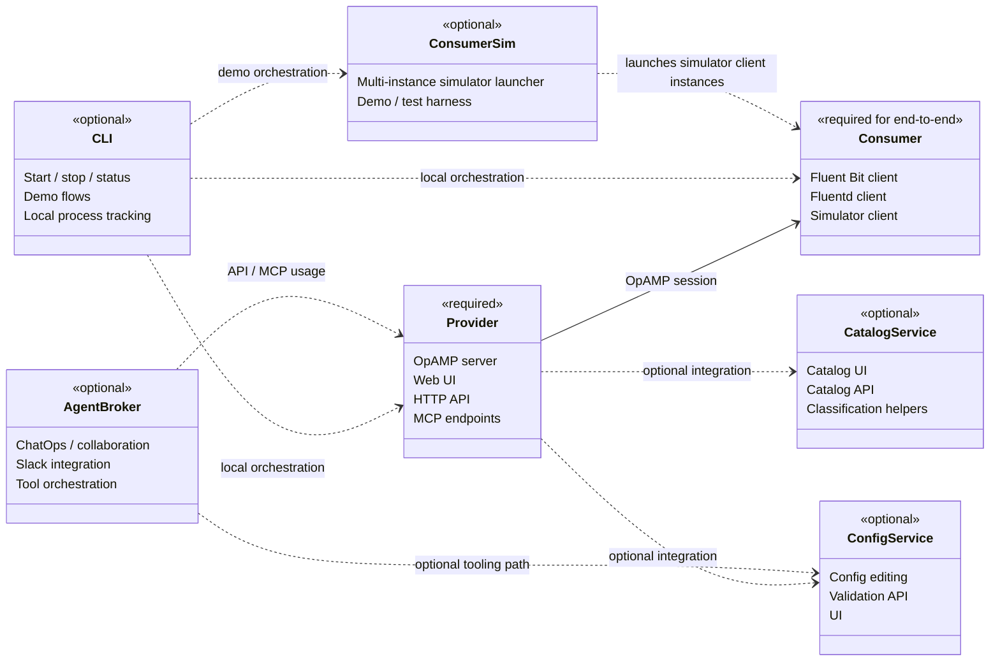
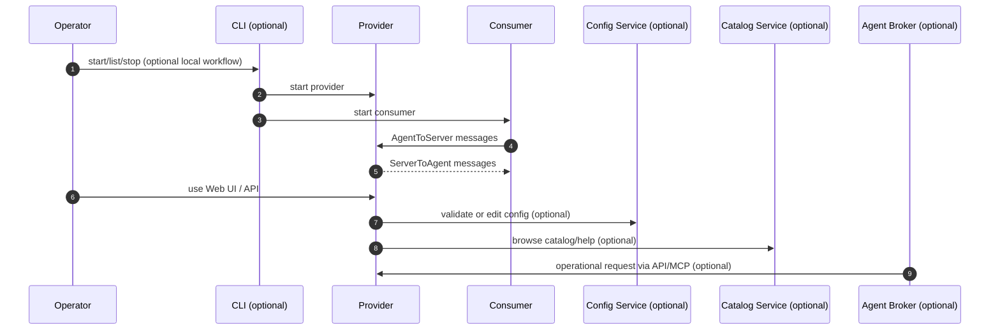
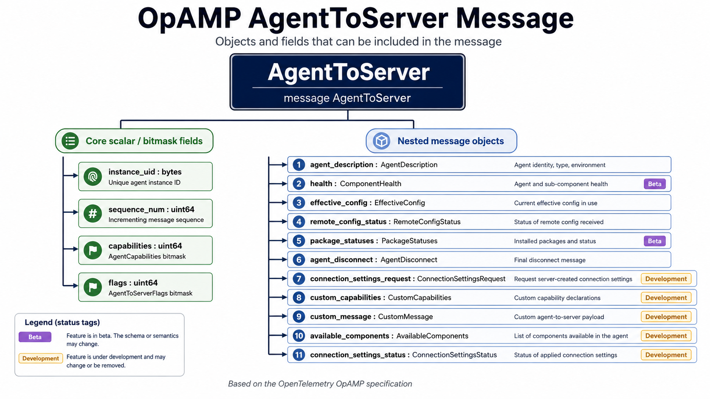
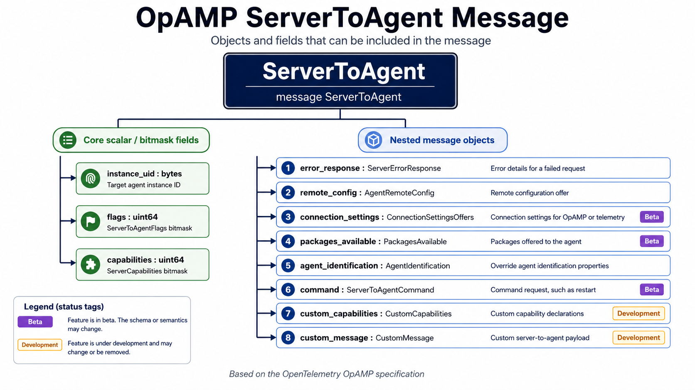

# Fluent OpAMP Documentation Hub

This repository contains a small but fairly complete OpAMP-oriented platform built around a provider,
consumers, optional configuration/catalog services, an optional local CLI, and an optional collaboration
broker.

Use this page as the documentation landing page for understanding:

- which components are required
- which components are optional
- how the components relate at runtime
- where to find the deeper component-specific guides

When the provider is running, the UI `Latest docs` links use `http://localhost:8080/doc-set`.
That route redirects to the URL configured in `provider.latest_docs_url`, which defaults to the
published landing-page preview for this documentation set.

## Build and packaging overview

The repository has two main packaging flows:

- `python dev-tools/main.py build artefact all`
  - builds per-component `sdist` + `wheel` artefacts
- `python dev-tools/main.py build release-assets`
  - builds independently deployable wheels
  - writes a separate CycloneDX SBOM for each selected component
  - supports subset builds with `--components`
  - supports GitHub release publication with `--publish`
  - supports `--no-isolation` for local/offline build environments
- `python scripts/security_checks.py`
  - compatibility wrapper for the full repository security gate

Common build output locations:

- `dist/provider/`
- `dist/consumer/`
- `dist/catalog/`
- `dist/cli/`
- `dist/consumer-sim/`
- `dist/sbom/`
- `dist/manual/`

Packaging notes:

- `opamp-cli` is packaged separately from the services it helps operate
- service/component builds may warn when `opamp-cli` is not present in the workspace or active environment
- `consumer-sim` can now be packaged and deployed independently as well as used from the source tree

See:

- [Scripts reference](../scripts/README.md)
- [Component Versioning](dev/component_versioning.md)
- [Config-service standalone packaging](../config-service/docs/standalone-packaging.md)
- [MCP scripts and usage](../mcp/README.md#build-pip-install-and-sbom)

## Minimum required stack

There are two useful definitions of "required":

- Required to run the server side only:
  - `provider`
- Required for an end-to-end OpAMP exchange:
  - `provider`
  - one consumer implementation from `consumer`

Everything else in this repository is optional, supportive, or internal.

## Component inventory

| Component | Role | Required | Deployment notes |
| --- | --- | --- | --- |
| `provider` | OpAMP server, Web UI, HTTP API, MCP endpoints | Yes | Primary control-plane component |
| `consumer` | OpAMP client/supervisor for Fluent Bit, Fluentd, and simulator flows | Yes for end-to-end OpAMP | At least one consumer is needed to exercise provider-to-agent behavior |
| `cli` | Local operator launcher/orchestration utility | Optional | Convenience tool for start/stop/status workflows |
| `config-service` | Configuration editor, validation API, Python-served UI | Optional | Can run standalone or be registered into the provider environment |
| `catalog-service` | Configuration catalog backend and UI | Optional | Can run standalone or be registered into the provider environment |
| `agent_broker` | Collaboration/chat-oriented broker with Slack integration | Optional | Separate process and separate deployment concern |
| `consumer-sim` | Multi-instance simulator launcher and test helper | Optional | Useful for demos, tests, and repeatable local scenarios |
| `mcp` | MCP client setup scripts and wrappers | Optional | Operational integration helper, not a core runtime service |
| `shared` | Shared Python utilities | Internal | Not deployed on its own |
| `proto` | Protobuf source definitions | Internal | Build/runtime dependency for provider and consumer packages |
| `scripts` | Build, run, packaging, and helper scripts | Internal | Supports development and packaging workflows |
| `docs` | Documentation set | Internal | This documentation tree |

## Required vs optional architecture

### Required runtime path

For a real OpAMP session, the minimum meaningful runtime path is:

1. `provider` starts and exposes the OpAMP/Web/API surface.
2. A `consumer` connects to the provider.
3. The consumer sends `AgentToServer` messages.
4. The provider sends `ServerToAgent` messages.

### Optional extensions

These components extend the baseline but are not required for the OpAMP protocol loop itself:

- `cli`
  - local operator convenience for launch/stop/list/status flows
- `config-service`
  - configuration editing and validation workflows
- `catalog-service`
  - catalog browsing and help content for supported configs
- `agent_broker`
  - collaboration and Slack-driven operational workflows
- `consumer-sim`
  - test/demo multi-instance launcher
- `mcp`
  - client bootstrap scripts for MCP consumers such as Codex or Claude Desktop

## UML component view

## UML interaction view

## Protocol message references

These two images are useful quick references when reading the provider and consumer code paths.

### AgentToServer

### ServerToAgent

## Component notes

### Provider

The provider is the central service in this repository.

It is responsible for:

- receiving OpAMP agent updates
- managing server-to-agent commands and remote configuration flows
- serving the browser UI
- exposing helper HTTP and MCP endpoints
- optionally hosting integrated configuration/catalog features

See:

- [Provider README](../provider/README.md)
- [Provider UI minification process](dev/dev-processes/minification_process.md)
- [Provider server UML source](<dev/server(provider)/provider_server_diagram.md>)
- [Provider rendered diagram walkthrough](provider_server_diagrams.md)
- [Endpoints](endpoints.md)
- [Authentication](authentication.md)

### Consumer

The consumer package contains the client-side runtime behaviors used to connect agents or supervisor-style
processes to the provider.

It includes:

- Fluent Bit-oriented client behavior
- Fluentd-oriented client behavior
- simulator client behavior
- custom handler support
- update controller behavior

See:

- [Consumer README](../consumer/README.md)
- [Consumer UML source](<dev/client(consumer)/consumer_client_diagram.md>)
- [Consumer rendered diagram walkthrough](consumer_client_diagrams.md)
- [Consumer custom handlers](<dev/client(consumer)/consumer_custom_handlers.md>)
- [Consumer update controllers](<dev/client(consumer)/consumer_update_controllers.md>)
- [Consumer mixin design](<dev/client(consumer)/consumer_mixins.md>)

### CLI

The CLI is an operator convenience layer. It is not required for protocol behavior, but it is useful for
local environments, demo flows, and guided operations.

See:

- [CLI README](../cli/README.md)
- [CLI docs index](../cli/docs/README.md)

### Config service

The config service is optional and focused on configuration editing, validation, rendering, and UI support.

See:

- [Config service README](../config-service/README.md)
- [UI testing guide](../config-service/docs/ui-testing.md)

### Catalog service

The catalog service is optional and focused on supported configuration examples, browseable catalog content,
classification, and help pages.

See:

- [Catalog service README](../catalog-service/README.md)
- [Catalog service docs](../catalog-service/docs/README.md)

### Agent broker

The broker is optional and sits outside the core provider/consumer loop. It is aimed at collaboration,
Slack integration, and operational tooling flows.

See:

- [Agent broker README](../agent_broker/README.md)
- [Agent broker docs index](../agent_broker/docs/README.md)

### Consumer simulator

The consumer simulator is optional and especially useful for test-container scenarios, demos, and repeatable
multi-instance runs.

See:

- [Consumer simulator README](../consumer-sim/README.md)
- [Simulator design](../consumer-sim/simulator_design.md)

## Project layout

- `agent_broker/` - optional collaboration broker package and docs
- `catalog-service/` - optional catalog service package and UI
- `cli/` - optional local CLI utility
- `config-service/` - optional config editor/validator service and UI
- `config/` - default runtime configuration files
- `consumer/` - required end-to-end client package
- `consumer-sim/` - optional simulator launcher utilities
- `dist/` - generated build artifacts and SBOM outputs
- `docs/` - project documentation
- `mcp/` - MCP client helper scripts and configuration wrappers
- `proto/` - protobuf definitions
- `provider/` - required server package
- `scripts/` - compatibility wrappers and low-level operational helper scripts
- `shared/` - internal shared Python utilities
- `tests/` - repository-level tests and container scenarios

## Core documentation map

- [Features and spec alignment](features.md)
- [OpAMP JSON reference map](opamp_json_reference.md)
- [Provider config reference](provider_config_reference.md)
- [UI screenshots](screenshots.md)
- [Scripts reference](scripts.md)
- [API gateway requirements](api_gateway_requirements.md)
- [Service daemon setup](service_daemon_setup.md)
- [Self-signed TLS setup](self_signed_tls_setup.md)
- [MCP scripts and setup](../mcp/README.md)

## Development documentation map

- [Development docs index](dev/index.md)
- [Design and implementation philosophy](dev/implementation_philosophy.md)
- [Command implementation notes](dev/command_process_implementation_note.md)
- [Adding your own custom action](dev/adding_your_own_custom_action.md)
- [Component versioning](dev/component_versioning.md)
- [UI consistency checklist](dev/ui_consistency_checklist.md)
- [Provider UI minification process](dev/dev-processes/minification_process.md)

## Documentation rules

- Treat `dev-notes/` as internal working notes only.
- Do not cross reference `dev-notes/` content from formal documentation, public help pages, or component READMEs.

## External references

- [Open Agent Management Protocol (OpAMP) Specification](https://opentelemetry.io/docs/specs/opamp/)
- [Model Context Protocol (MCP) Specification](https://modelcontextprotocol.io/specification/2025-11-25)
- [Fluent Bit](https://fluentbit.io/)
- [Fluentd](https://www.fluentd.org/)
- [Quart](https://quart.palletsprojects.com/en/latest/)
- [CycloneDX](https://cyclonedx.org/)
- [OpAMP posts on blog.mp3monster.org](https://blog.mp3monster.org/category/technology/fluent-observability/opamp/)
