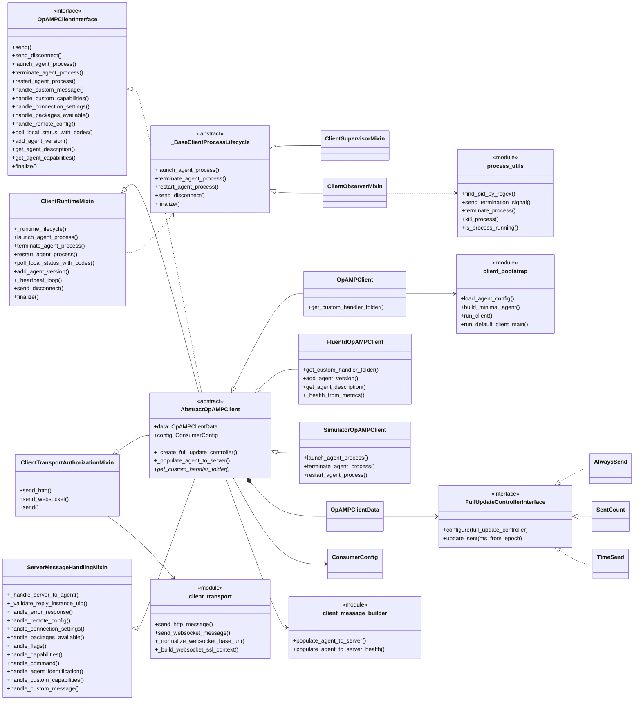
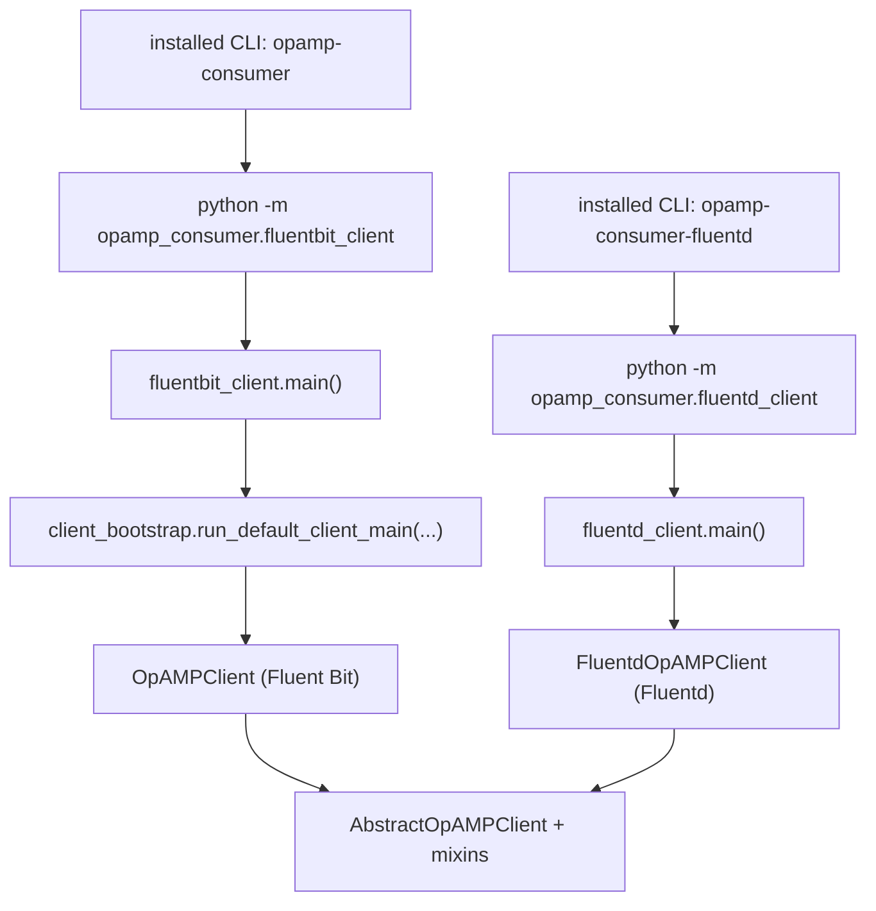
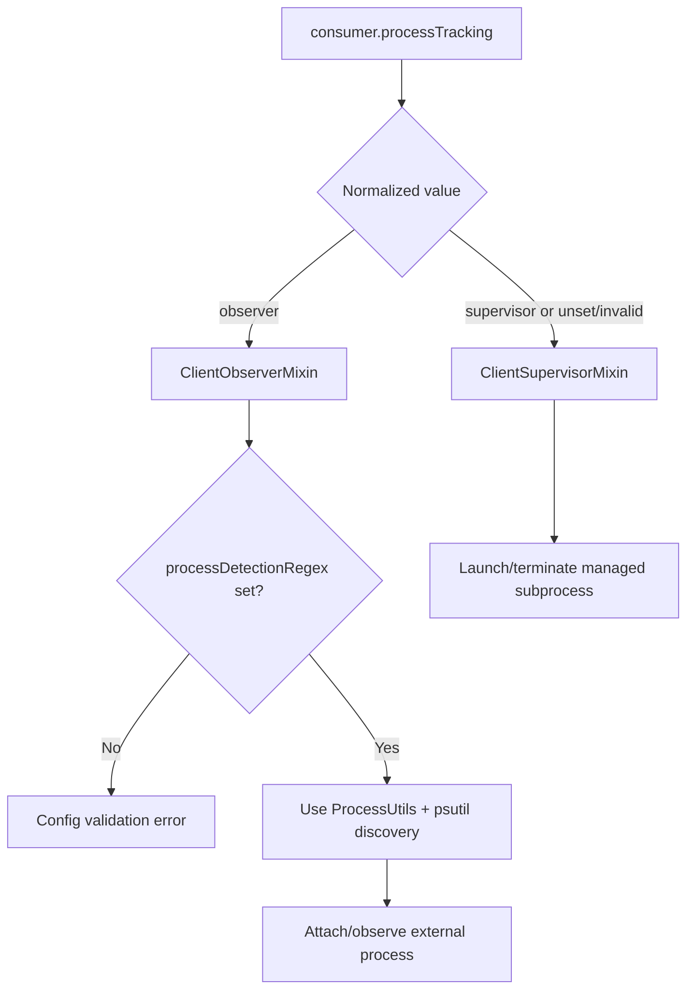
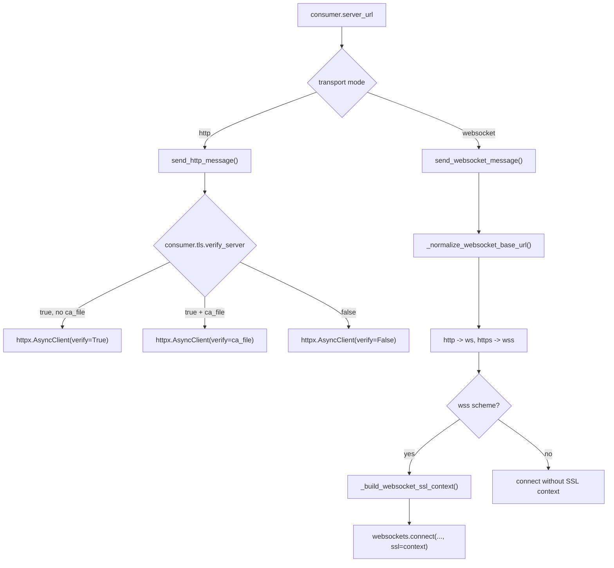
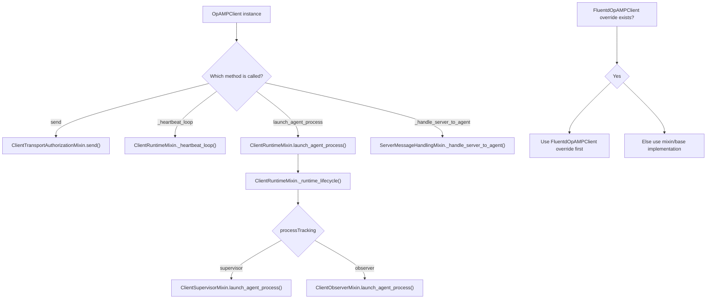
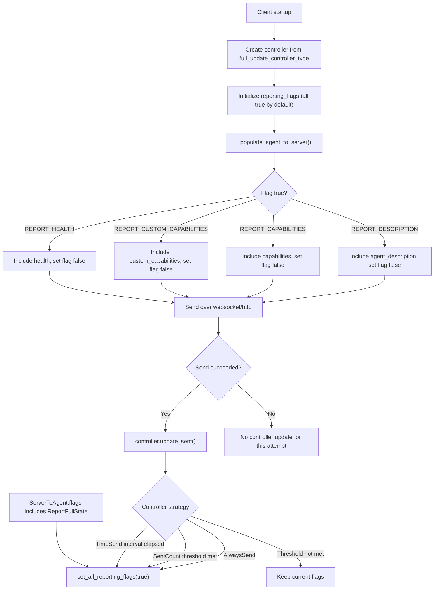

# Consumer Client Architecture Diagram

This diagram set shows the current consumer structure after splitting behavior into focused modules and introducing runtime lifecycle strategies (`Supervisor` and `Observer`).

## Class and Module Relationships

## Runtime Entrypoints

## Runtime Process Tracking Strategy

## Transport URL and TLS Resolution

## Mixin Dispatch Model

## Reporting Flags and Update Controllers

