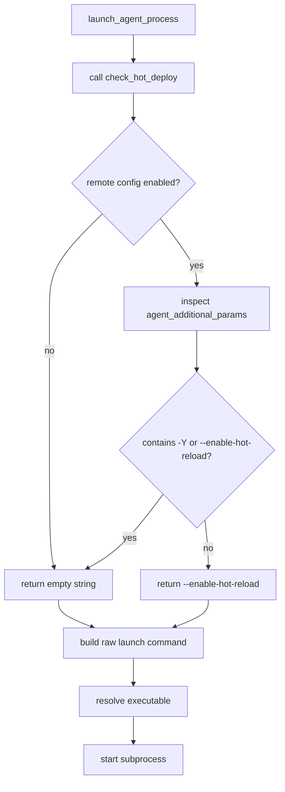
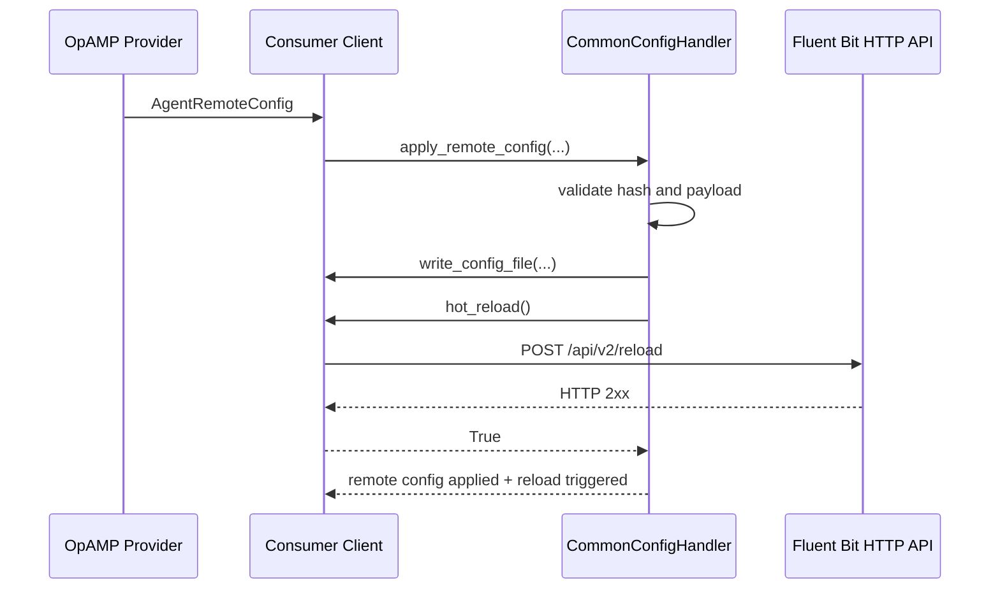
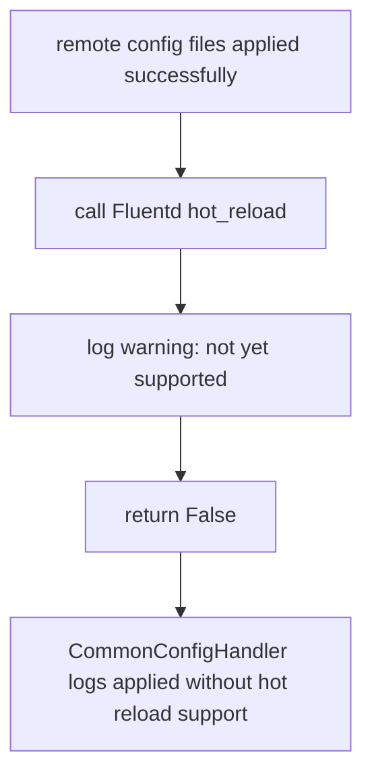
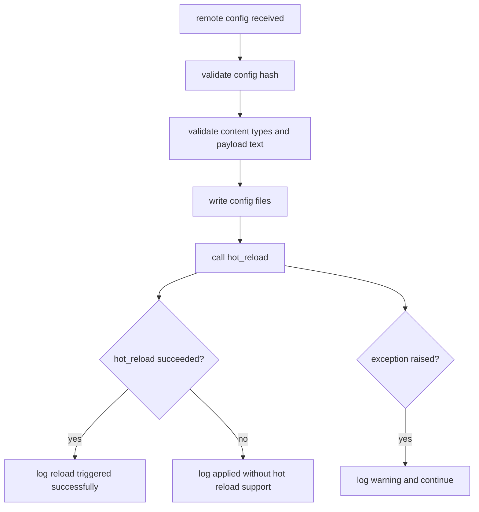

# Consumer Restart And Hot-Deploy Implementation

## Purpose

This note describes the restart and hot-deploy functionality added to the consumer-side client implementations, with particular focus on:

- launch-time hot-deploy flag injection
- runtime restart handling
- runtime hot-reload invocation after remote config application
- differences between Fluent Bit and Fluentd behavior

The implementation spans the shared consumer client abstractions plus the Fluent Bit and Fluentd concrete clients.

## Summary

The current implementation now provides three related behaviors:

1. `restart_agent_process()`
   Used when the server sends an OpAMP restart command, or when restart is invoked locally through the existing process lifecycle.

2. `check_hot_deploy()`
   Used during process launch to decide whether the client should inject `--enable-hot-reload` into the managed agent command line.

3. `hot_reload()`
   Used after remote config files have been successfully written so the running agent can reload in-place without a full process restart when supported.

In Python code these methods use underscores rather than hyphens:

- `restart_agent_process`
- `check_hot_deploy`
- `hot_reload`

## Files Changed

The main implementation points are:

- `consumer/src/opamp_consumer/opamp_client_interface.py`
- `consumer/src/opamp_consumer/abstract_client.py`
- `consumer/src/opamp_consumer/client_supervisor_mixin.py`
- `consumer/src/opamp_consumer/common_config_handler.py`
- `consumer/src/opamp_consumer/client_server_message_mixin.py`
- `consumer/src/opamp_consumer/fluentbit_client.py`
- `consumer/src/opamp_consumer/fluentd_client.py`

The focused tests were added or extended in:

- `consumer/tests/test_client_transport_and_disconnect.py`
- `consumer/tests/test_fluentd_client.py`
- `consumer/tests/test_common_config_handler.py`
- `consumer/tests/test_custom_handlers_chatops.py`
- `consumer/tests/test_custom_handlers_registry.py`

## High-Level Design

### Restart

Restart is the explicit process-level lifecycle action. It is intended for:

- provider-issued OpAMP restart commands
- local restart flows already present in the lifecycle layer

This remains a lifecycle concern handled by the runtime strategy:

- supervisor mode stops and relaunches the agent process
- observer mode detaches and re-attaches to the externally managed process

### Hot-Deploy

Hot-deploy is the launch-time readiness behavior. It ensures that when remote config is enabled, the launched agent is started with hot-reload support if that support has not already been configured manually.

For both Fluent Bit and Fluentd the check currently looks for either of these existing launch flags:

- `-Y`
- `--enable-hot-reload`

If neither is present, the client returns:

- `--enable-hot-reload`

If one is already present, the client returns:

- `""`

### Hot Reload

Hot reload is the runtime action performed after config files have already been written successfully.

- Fluent Bit: performs an HTTP `POST` to `/api/v2/reload`
- Fluentd: logs a warning and returns `False` because the feature is not yet implemented in the consumer client

## Methods to support Hot Deploy

The shared client interface now exposes two new methods in addition to the existing restart lifecycle methods:

```python
def check_hot_deploy(self) -> str:
    ...

def hot_reload(self) -> bool:
    ...
```

This means all client implementations now participate in a common contract:

- lifecycle restart behavior
- launch-time hot-deploy evaluation
- post-config-apply hot reload behavior

The abstract base client provides default behavior:

- `check_hot_deploy()` returns `""`
- `hot_reload()` logs a warning and returns `False`

Concrete agent clients override these methods where needed.

## Restart Flow

Restart behavior already existed in the lifecycle layer and remains the same in principle.

### Trigger Sources

Restart may be triggered by:

- a `ServerToAgentCommand` with `CommandType_Restart`
- direct internal restart calls

### Restart Command Handling

`client_server_message_mixin.py` still routes restart commands like this:

1. receive `ServerToAgent.command`
2. detect `CommandType_Restart`
3. call `restart_agent_process()`

### Supervisor Restart Behavior

In supervisor mode:

1. acquire the process lock
2. terminate the tracked process
3. call `launch_agent_process()`
4. raise if relaunch fails

That means any hot-deploy launch-flag logic is automatically reused during restart relaunches.

### Observer Restart Behavior

In observer mode:

1. detach from the current observed process state
2. wait briefly
3. re-run observer attach logic

Because observer mode does not launch a new local process itself, the launch-time command injection logic is not used there. However, remote-config hot reload can still run because it is independent of the launch strategy.

## Launch-Time Hot-Deploy Logic

### Decision Inputs

The hot-deploy decision is based on:

- configured agent capabilities
- the effective enabled capability set
- configured `agent_additional_params`

### Capability Handling

The primary capability name is:

- `AcceptsRemoteConfig`

A compatibility path was also added so the hot-deploy check recognizes the legacy/mistyped alias:

- `AcceptRemoteConfig`

This matters because some configuration examples or experiments may still carry the older name even though the supported capability name in the codebase is `AcceptsRemoteConfig`.

### Shared Decision Logic

The shared base client now contains `_check_hot_deploy_flag(expected_flags)`.

Its behavior is:

1. determine whether remote config should imply hot-deploy readiness
2. inspect `agent_additional_params`
3. if one of the expected flags is already present, return `""`
4. otherwise return `--enable-hot-reload`
5. if any error occurs, log it and return `""`

### Launch Command Assembly

`client_supervisor_mixin.py` now calls `self._owner.check_hot_deploy()` before constructing the process command.

The command layout is now:

1. runtime executable
2. configured `agent_additional_params`
3. optional injected hot-deploy flag
4. config flag such as `-c`
5. config path

If the hot-deploy method raises unexpectedly, the error is logged and launch proceeds without injecting the flag.

### Launch Decision Flow



## Fluent Bit Hot-Deploy And Hot-Reload Behavior

### Launch-Time Behavior

The Fluent Bit client overrides `check_hot_deploy()` and delegates to the shared helper with:

- `("-Y", "--enable-hot-reload")`

Reference in code comments:

- `https://docs.fluentbit.io/manual/administration/hot-reload`

### Runtime Hot Reload

The Fluent Bit client also overrides `hot_reload()`.

After remote config is successfully written, it:

1. resolves the local agent HTTP port from:
   - `agent_http_port`, else
   - `client_status_port`
2. resolves the host from:
   - `agent_http_listen`, else
   - `localhost`
3. normalizes `0.0.0.0` to `localhost`
4. preserves `http` or `https` from `config.server_url` when available
5. performs:
   - `POST <scheme>://<host>:<port>/api/v2/reload`
6. returns `True` on success
7. logs a warning and returns `False` on failure

### Important Note About `server_url`

The user request originally referred to using `consumer.server_url` to locate the Fluent Bit instance.

In this codebase, `server_url` is the OpAMP provider endpoint, not the local Fluent Bit admin endpoint.

Because of that, the implementation uses the agent-local HTTP status settings instead:

- `agent_http_port`
- `client_status_port`
- `agent_http_listen`

The only part borrowed from `server_url` is the scheme (`http` or `https`) when it is usable.

### Fluent Bit Reload Flow



## Fluentd Hot-Deploy And Hot-Reload Behavior

### Launch-Time Behavior

The Fluentd client implements the same launch-time flag check as Fluent Bit:

- if remote config is enabled and no hot-reload flag exists, return `--enable-hot-reload`
- if `-Y` or `--enable-hot-reload` already exists, return `""`
- on error, log and return `""`

Reference in code comments:

- `https://docs.fluentbit.io/manual/2.2/administration/hot-reload`

### Runtime Hot Reload

For Fluentd, `hot_reload()` currently does not issue any API or process action.

Instead it:

1. logs a warning that Fluentd hot reload is not yet supported by this client
2. returns `False`

This means remote config file application can still succeed, but the system does not yet perform an in-place Fluentd reload automatically.

### Fluentd Reload Flow



## Remote Config Apply Integration

The remote config handler changed in an important way.

Previously it:

1. validated the config hash
2. validated payload content
3. wrote each file

Now it additionally:

4. calls `opamp_client.hot_reload()` after all config files have been written successfully

### Behavior After Apply

After the write loop completes:

- if `hot_reload()` returns `True`
  - log that hot reload was triggered successfully
- if `hot_reload()` returns `False`
  - log that the config was applied without hot reload support
- if `hot_reload()` raises
  - catch the exception
  - log a warning
  - do not fail the remote config apply retroactively

This makes hot reload best-effort rather than part of the write transaction.

### Post-Apply Decision Flow



## Error Handling Model

### `check_hot_deploy()`

Any error during hot-deploy evaluation:

- is logged
- returns `""`
- does not block launch

### `hot_reload()`

For Fluent Bit:

- API failure logs a warning
- returns `False`

For Fluentd:

- not implemented logs a warning
- returns `False`

### `apply_remote_config()`

If file validation or writing fails:

- the remote config apply fails
- backups are restored where appropriate

If hot reload fails after writes succeed:

- the remote config apply is still considered applied
- the failure is only logged

This is an intentional separation between:

- config persistence correctness
- runtime reload convenience

## Current Behavioral Matrix

| Area | Fluent Bit | Fluentd |
|---|---|---|
| Supports `AcceptsRemoteConfig` launch check | Yes | Yes |
| Injects `--enable-hot-reload` at launch when needed | Yes | Yes |
| Accepts existing `-Y` / `--enable-hot-reload` without duplication | Yes | Yes |
| Has runtime `hot_reload()` implementation | Yes | Partial stub |
| Runtime hot reload action | `POST /api/v2/reload` | Warning only |
| Remote config apply triggers `hot_reload()` | Yes | Yes, but returns `False` |
| Provider restart command support | Existing restart path | Existing restart path |

## Test Coverage Added

The implementation is covered by focused tests for:

- Fluent Bit launch command injection of `--enable-hot-reload`
- Fluent Bit compatibility with legacy `AcceptRemoteConfig`
- Fluent Bit `POST /api/v2/reload`
- Fluent Bit safe handling when no local HTTP port is configured
- Fluentd `check_hot_deploy()` flag return
- Fluentd no-duplicate behavior when `-Y` already exists
- Fluentd error handling in `check_hot_deploy()`
- Fluentd warning-only `hot_reload()`
- remote config apply invoking `hot_reload()` after file writes
- interface test doubles updated for the new methods

## Practical End-To-End Behavior

### On Startup

If the consumer is supervising a Fluent Bit or Fluentd process and remote config is enabled:

- the launch command is made hot-reload capable unless already configured that way

### On Provider Restart Command

If the provider sends a restart command:

- the consumer performs the existing lifecycle restart
- any launch-time hot-deploy injection is re-evaluated during the relaunch

### On Remote Config Delivery

If the provider sends remote config:

- files are validated and written
- then `hot_reload()` is attempted
- for Fluent Bit this tries an in-place reload
- for Fluentd this currently logs a warning only

## Known Limitations

1. Fluentd runtime hot reload is not implemented yet.
2. Hot reload is best-effort and does not currently update remote-config status based on reload API success or failure.
3. The local reload endpoint resolution depends on the agent HTTP settings being configured correctly.
4. Observer-mode deployments do not use launch-time command injection because they do not spawn the process locally, although post-apply `hot_reload()` still runs.
5. The legacy alias `AcceptRemoteConfig` is supported only as a compatibility assist for hot-deploy checks, not as a canonical capability name.

## Suggested Future Follow-Ups

Potential next steps:

- implement real Fluentd reload behavior if a safe supported mechanism is identified
- decide whether hot-reload failure should influence `remote_config_status`
- add more explicit telemetry around:
  - reload attempted
  - reload succeeded
  - reload failed
- consider documenting the required agent HTTP settings directly in user-facing consumer docs
- decide whether reload should be conditional on process tracking mode or config type nuances beyond the current implementation

