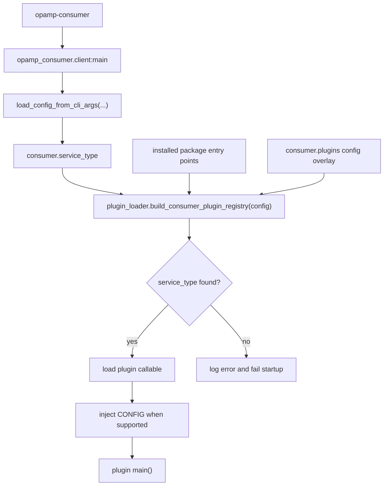

# Architecture And Loading

The consumer has one stable command for normal use:

```bash
opamp-consumer --config-path ./opamp.json
```

That command enters `opamp_consumer.client:main`. The router is intentionally
small. It parses enough shared CLI/config state to know which `service_type`
has been requested, asks the plugin loader for the matching callable, injects
the loaded config into the target module when the module exposes `CONFIG`, and
then calls the plugin entry point.

For the full picture, keep the
[consumer client architecture diagram](../consumer_client_diagram.md) open.
The "Runtime Entrypoints" diagram on that page shows the same flow visually.

## Loading Flow



The code for this lives mainly in:

- `consumer/src/opamp_consumer/client.py`
- `consumer/src/opamp_consumer/plugin_loader.py`
- `consumer/src/opamp_consumer/config.py`
- `consumer/src/opamp_consumer/plugin_config.py`

## Plugin Registry Sources

The plugin registry has two sources.

Installed package entry points are discovered from package metadata:

```toml
[project.entry-points."opamp_consumer.plugins"]
my_agent = "my_consumer_plugin.client:main"
```

Runtime config entries are read from `consumer.plugins`:

```json
{
  "consumer": {
    "service_type": "my_agent",
    "plugins": [
      {
        "service_type": "my_agent",
        "entry_point": "my_consumer_plugin.client:main",
        "enabled": true
      }
    ]
  }
}
```

The loader builds the installed-entry-point registry first. Then it applies the
config overlay. That means config can:

- add a plugin that is importable but has no package entry point
- override an installed plugin mapping
- disable an installed plugin by setting `enabled` to `false`

This is deliberate. It gives packaged plugins a clean deployment story, while
still making local tests and one-off experiments easy.

## Service Type Names

`service_type` is the registry key. It is normalized to lowercase and stripped
of surrounding whitespace.

Good names are short and stable:

- `fluentbit`
- `fluentd`
- `elastic_agent`
- `simulator`
- `my_agent`

Avoid putting version numbers, environment names, or deployment names into the
service type. Those belong in config, package versions, or deployment metadata.

## What Happens After Loading?

After the plugin `main()` runs, the plugin is responsible for the normal
consumer bootstrap:

1. parse common CLI args with `build_common_cli_parser()`
2. load config with `load_config_from_cli_args()`
3. configure logging with `configure_logging_for_config()`
4. log the startup banner with `log_consumer_startup_banner()`
5. process plugin/agent-specific config
6. construct the concrete client
7. call the shared `run_client(...)` loop

Fluent Bit uses `run_default_client_main(...)` because its startup flow is the
default shared path. Fluentd, Elastic Agent, and simulator have their own
`main()` functions because they need extra startup work.

