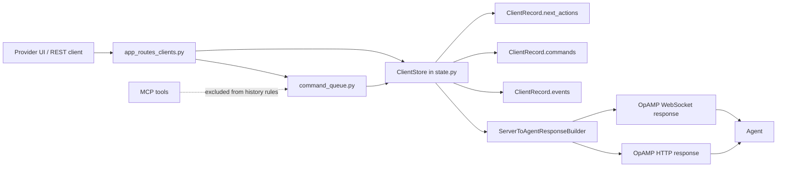
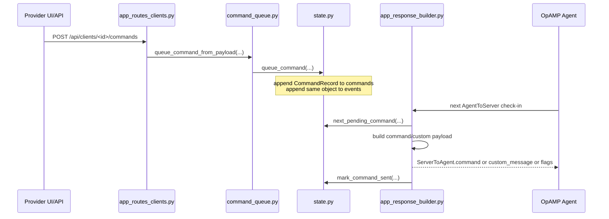
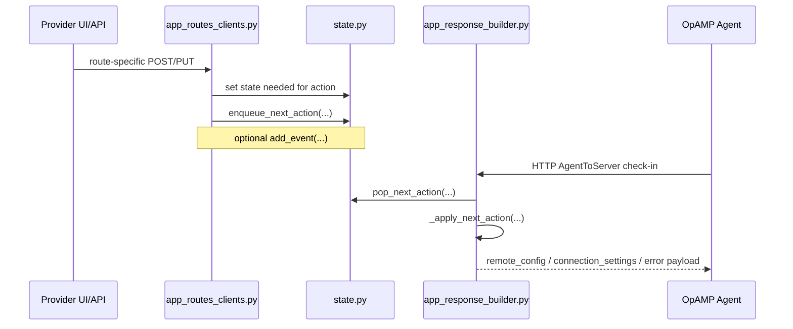
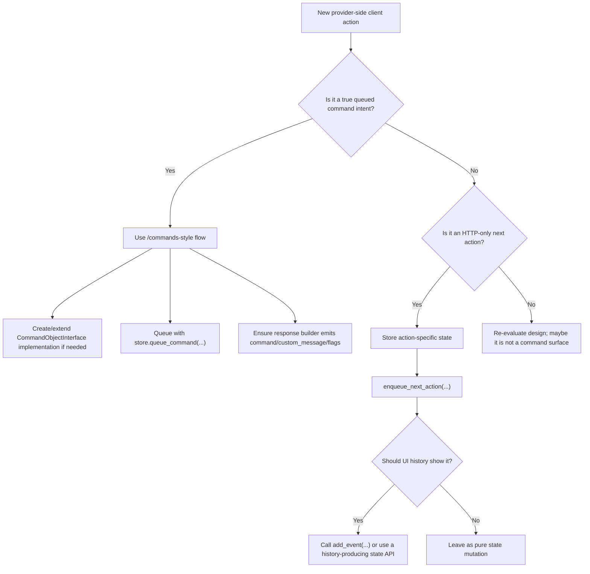

# Provider Command And Event Flow Guide

This guide explains how provider-side command intents, next actions, and history events move through the codebase and reach an OpAMP client.

It is intended to serve two audiences:

- developers adding or refactoring a provider-side command or client-directed action
- tool-assisted workflows, including prompts for tools such as Codex

## Scope

This guide covers:

- provider REST/UI command and client-action entry points
- in-memory state and history behavior
- response building and transport send behavior
- how standard commands, custom commands, remote config, identification, heartbeat changes, and other next actions differ
- developer expectations around history creation

This guide does not attempt to document consumer-side custom handler internals in detail. For that, see:

- [Adding Your Own Custom Action](../adding_your_own_custom_action.md)
- [Consumer Custom Handlers](<../client(consumer)/consumer_custom_handlers.md>)
- [Command Process Implementation Note](../command_process_implementation_note.md)

## Key Rule

Treat provider UI/API activity and MCP activity differently.

- Provider UI/API flows define the user-visible client history behavior.
- MCP activity should be excluded from the history rules described here.
- If an MCP path currently reuses a history-producing helper, treat that as an implementation detail or technical debt, not the desired contract for future work.

In other words: do not use MCP behavior as the reference model when deciding whether a provider-side client action should create a history entry.

## High-Level Model

There are three related but distinct concepts in the provider:

1. `CommandRecord`
   Used for queued command intents such as restart, force resync, and custom commands. These live in `ClientRecord.commands`.
2. `next_actions`
   Used for provider-directed actions that are not stored as `CommandRecord` objects, such as applying remote config or changing connection settings.
3. `EventHistory`
   Used for user-visible history items that are not naturally represented as commands, or when the route adds history manually.

The key design consequence is that not every client-directed operation follows the same storage or history path.

## Code Map

Primary files:

- `provider/src/opamp_provider/app_routes_clients.py`
- `provider/src/opamp_provider/command_queue.py`
- `provider/src/opamp_provider/state.py`
- `provider/src/opamp_provider/app_response_builder.py`
- `provider/src/opamp_provider/app.py`
- `provider/src/opamp_provider/commands.py`

Related docs:

- [Command Process Implementation Note](../command_process_implementation_note.md)
- [Adding Your Own Custom Action](../adding_your_own_custom_action.md)
- [Provider Server Diagram (Mermaid Source)](provider_server_diagram.md)

## Architecture Overview



## Command And Event Surfaces

The provider currently uses several different surfaces to send data to a client.

| Surface | Route | State primitive | History behavior | Sent over |
| --- | --- | --- | --- | --- |
| Standard/custom command | `POST /api/clients/<client_id>/commands` | `CommandRecord` in `commands` | Automatic via `queue_command(...)` | HTTP and WebSocket |
| Heartbeat change | `PUT /api/clients/<client_id>/heartbeat-frequency` | client field + event | Automatic inside `set_client_heartbeat_frequency(...)` | no dedicated send token in the current route; stored state is available to connection-settings builders |
| Issue new unique ID | `POST /api/clients/<client_id>/identify` | pending identification field | Manual `add_event(...)` in route | HTTP and WebSocket |
| Requested config text | `POST /api/clients/<client_id>/config` | `requested_config` fields | No history in current route | separate effective config flow, not a queued command |
| Remote config files | `POST /api/clients/<client_id>/remote-config` | pending remote config + `next_actions` | Manual `add_event(...)` in route | HTTP next action (`apply_config`) |
| Generic next actions | `POST /api/clients/<client_id>/actions` | `next_actions` | No history in current route | HTTP only |

This table is the core reason developers need to be explicit: only some paths create history as part of the state mutation itself.

## The Preferred Pattern For True Commands

For provider UI/API initiated commands, the cleanest pattern is:

1. validate and normalize request payload
2. create a `CommandRecord`
3. append it to `ClientRecord.commands`
4. append the same intent to unified event history
5. build the outbound OpAMP payload on the next client check-in
6. mark the command sent once a command payload was actually emitted

That pattern is implemented by:

- `queue_command_from_payload(...)` in `command_queue.py`
- `store.queue_command(...)` in `state.py`

## Standard/Custom Command Flow



### What gets stored

`store.queue_command(...)` does two things at once:

- appends a `CommandRecord` to `ClientRecord.commands`
- appends that same command record to `ClientRecord.events`

That makes `queue_command(...)` the main history-producing API for command-like behavior.

### What gets sent

`ServerToAgentResponseBuilder._apply_command_intent(...)` maps the queued command to an outbound payload:

- restart -> `ServerToAgent.command`
- force resync -> `ServerToAgent.flags`
- `custom` or `custom_command` -> `ServerToAgent.custom_message`

### When the command is marked sent

The provider marks a queued command as sent only after a command payload was actually emitted:

- HTTP path: `app.py` calls `mark_command_sent(...)` after `has_dispatched_command_payload(...)`
- WebSocket path: same rule

History is therefore created at queue time, not at send time.

## Next-Action Flow

Some provider actions are not modeled as `CommandRecord`.

Examples:

- remote config delivery
- package-availability placeholder behavior

These use `ClientRecord.next_actions` and are consumed separately from `commands`.



### Important transport detail

`next_actions` are currently popped only for the HTTP channel in `build_response(...)`.

That means:

- queued commands can be dispatched on HTTP or WebSocket
- `next_actions` such as remote config apply are currently HTTP-only

This matters when you add a new client-directed action. Decide whether it is a true queued command or an HTTP-only next action before implementing it.

## History-Producing APIs

The main store APIs and their history behavior are:

| API | History behavior | Notes |
| --- | --- | --- |
| `queue_command(...)` | Automatic | Preferred for true commands |
| `set_client_heartbeat_frequency(...)` | Automatic | Specialized mutation with built-in event creation |
| `add_event(...)` | Manual | Use when the route must create a history item explicitly |
| `enqueue_next_action(...)` | None | Must be paired with `add_event(...)` if UI history is required |
| `set_next_actions(...)` | None | Pure state mutation |
| `set_requested_config(...)` | None | Pure state mutation |
| `set_agent_identification(...)` | None | Route currently adds history manually |
| `set_pending_remote_config(...)` | None | Route currently adds history manually |

## Current Provider Patterns

### Unified command path

These already follow a clear command queue pattern:

- `POST /api/clients/<client_id>/commands`
- custom command submission from the provider UI through that same route

These are the best reference implementations for new command work.

### Specialized but still history-safe

These do produce history, but not through `queue_command(...)`:

- `PUT /api/clients/<client_id>/heartbeat-frequency`
- `POST /api/clients/<client_id>/identify`
- `POST /api/clients/<client_id>/remote-config`

Two different subpatterns exist here:

- heartbeat: the state API itself appends history
- identify and remote config: the route mutates state, then calls `add_event(...)`

One important implementation detail:

- the heartbeat route records state and history, but it does not currently enqueue `change_connections` on its own

### Routes with no current history

These routes change client-directed state but do not currently add a history item:

- `POST /api/clients/<client_id>/actions`
- `POST /api/clients/<client_id>/config`

When modifying these areas, decide explicitly whether the absence of history is intentional or accidental.

## MCP Exclusion

For this guide, MCP activity is excluded from the history contract.

Why:

- MCP is an automation and tooling surface, not the canonical UI-facing activity model.
- Developers should not infer user-visible history requirements from MCP helpers.
- Future command additions should preserve a clean distinction between provider UI/API history semantics and MCP automation semantics.

### Practical rule

When you add or refactor a provider-side action:

- design history behavior based on the provider UI/API route
- do not treat MCP tool usage as evidence that the action should appear in the client history

### Current-code caveat

Some MCP helpers currently reuse command queue helpers that append history automatically.

That does not change the design guidance above. If you are normalizing behavior in the future, prefer to preserve or restore the rule that MCP-originated activity should not drive UI history expectations.

## How To Add A New Command

Use this decision tree first.



### Step 1: Decide the semantic category

Ask these questions:

- Will the action be represented as a command intent that should appear in `ClientRecord.commands`?
- Should it be dispatchable on both HTTP and WebSocket?
- Is there a natural `classifier` and `action` pair?
- Should it appear in user-visible client history?

If the answer is yes to the first three, it usually belongs on the command queue path.

### Step 2: For true commands, prefer the command queue path

Use or extend:

- `POST /api/clients/<client_id>/commands`
- `queue_command_from_payload(...)`
- `store.queue_command(...)`
- `ServerToAgentResponseBuilder._apply_command_intent(...)`

For custom commands:

- add a command implementation under `provider/src/opamp_provider/command_implementations/`
- rely on startup discovery in `commands.py`
- rely on wildcard custom routing rather than per-command builder registration

This is documented in more detail in [Adding Your Own Custom Action](../adding_your_own_custom_action.md).

### Step 3: For next actions, be explicit about history

If the action is implemented with:

- `enqueue_next_action(...)`
- `set_pending_remote_config(...)`
- `set_next_actions(...)`
- `set_agent_identification(...)`

then history will not happen automatically unless you add it deliberately.

Do not assume that queuing something for the client automatically creates a timeline event.

### Step 4: Confirm send-channel behavior

Before shipping a new action, verify:

- should it dispatch on HTTP only?
- should it dispatch on WebSocket too?
- is it consumed from `commands`, `next_actions`, or another state field?

If you use `next_actions`, the current implementation is HTTP-only.

### Step 5: Add tests at the right layers

Recommended test layers:

- route test for validation and queueing behavior
- state/store test if new mutation/history behavior is introduced
- response-builder test for outbound protobuf shape
- end-to-end provider endpoint test covering queue and consume
- UI metadata test for custom commands if the command is user-selectable

History-specific assertions should verify the intended policy:

- command route -> history created automatically
- next-action route -> history only when explicitly added
- MCP-specific tests should not define UI-history expectations

## Checklist For Developers

When adding or refactoring a provider-side command or client action:

- decide whether it is a `CommandRecord` flow or a `next_actions` flow
- choose the transport expectation: HTTP-only or HTTP plus WebSocket
- decide whether the action should create a user-visible history entry
- if it should, use a history-producing API or add `store.add_event(...)`
- if it is MCP-only or MCP-originated, do not use it to define history rules
- add or update tests for queueing, dispatch, and history behavior
- link the change back to the custom-command docs when relevant

## Prompt Template For Codex Or Similar Tools

Use the following prompt as a starting point when asking a coding tool to add or refactor a provider-side command:

```text
Implement a new provider-side client action in this repo.

Before editing, read:
- docs/dev/server(provider)/provider_command_and_event_flow_guide.md
- docs/dev/adding_your_own_custom_action.md
- docs/dev/command_process_implementation_note.md

Requirements:
- Treat provider UI/API command behavior as the source of truth.
- Exclude MCP activity from the history requirements for this task.
- Decide whether the new behavior belongs on the CommandRecord path or the next_actions path.
- If it is a true command, prefer the existing /api/clients/<client_id>/commands flow and store.queue_command(...).
- If it is a next action, be explicit about whether it should create UI-visible history.
- Do not assume enqueue_next_action(...) or other state setters create history automatically.
- Verify whether the action should dispatch over HTTP only or over HTTP and WebSocket.
- Add tests for validation, queueing, dispatch shape, and history behavior.

Deliverables:
- code changes
- test updates
- a short explanation of which state/history path was chosen and why
```

## Recommended Reading Order

For a new contributor:

1. Read this guide first.
2. Read [Command Process Implementation Note](../command_process_implementation_note.md) for the lower-level command queue details.
3. Read [Adding Your Own Custom Action](../adding_your_own_custom_action.md) when the change involves a new custom command implementation.
4. Read [Consumer Custom Handlers](<../client(consumer)/consumer_custom_handlers.md>) if a new consumer capability handler is needed.

## Summary

The provider does not have a single universal path for all client-directed actions.

- `queue_command(...)` is the clean, history-producing path for true commands.
- `next_actions` and other state setters are separate mechanisms and usually require explicit history decisions.
- send behavior differs by channel: queued commands can go over HTTP or WebSocket, while `next_actions` are currently applied only on HTTP.
- MCP activity should be excluded when defining or reviewing provider UI history behavior.

If you follow those rules first, the implementation choices in this area become much easier to make consistently.
